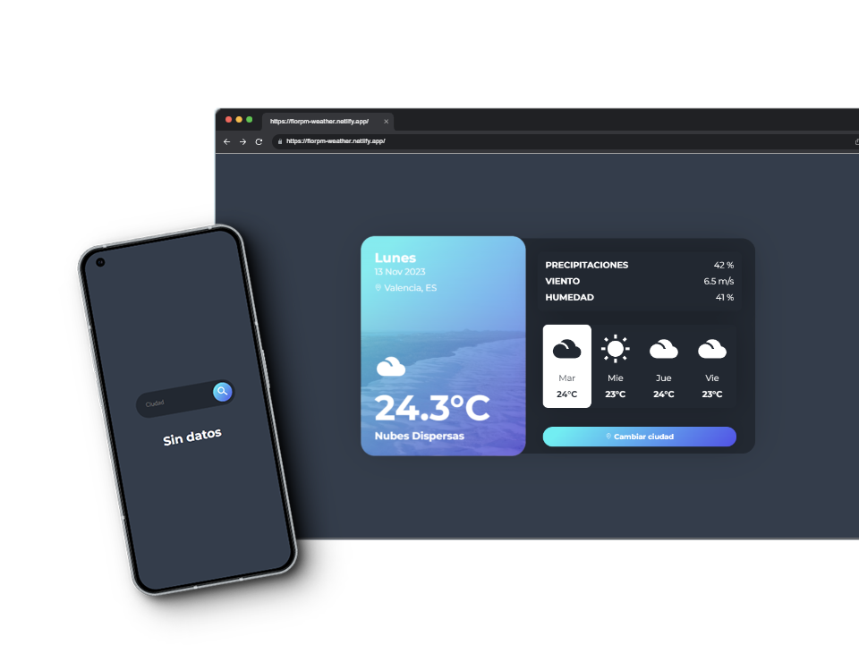

# ¡Bienvenidos a la Aplicación de Pronóstico del Tiempo!🌦️

Esta aplicación utiliza la API de OpenWeatherMap para proporcionarte información precisa sobre el clima en cualquier ciudad del mundo.

A continuación, algunas imágenes de la aplicación:

Puedes usarla en cualquier dispositivo, desde tu ordenador hasta tu teléfono móvil. 💻📱

¡Espero que esta aplicación te sea útil para mantenerte informado sobre las condiciones del tiempo en tu ciudad o donde quieras!

Puedes probarla en línea desde el siguiente enlace:

[Sitio Web](https://florpm-weather.netlify.app/) 🖥️

## Tecnologías utilizadas

